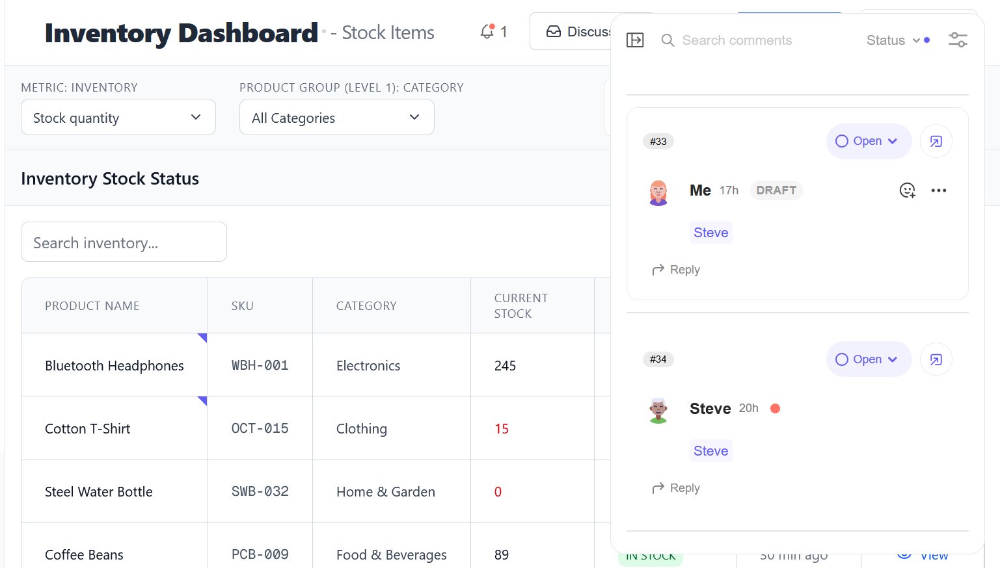
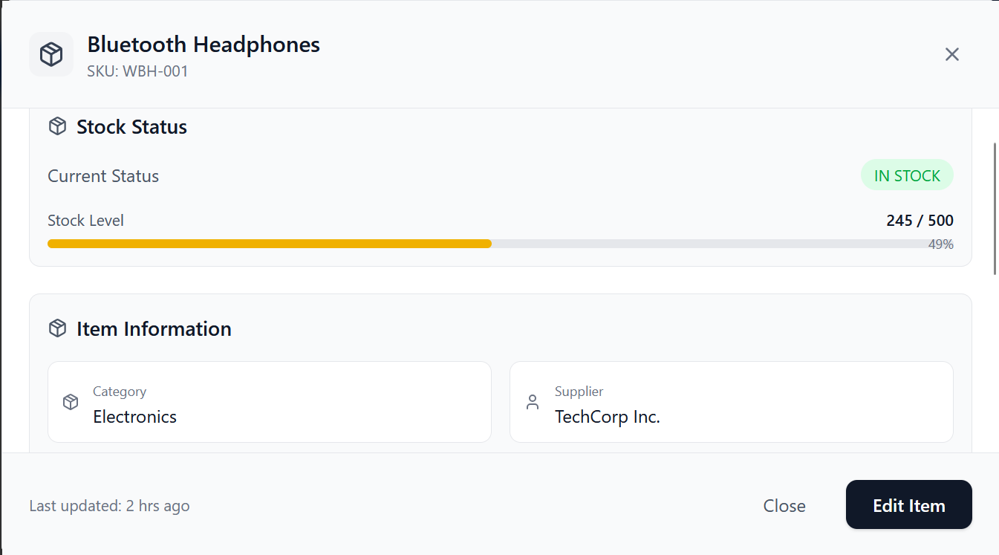
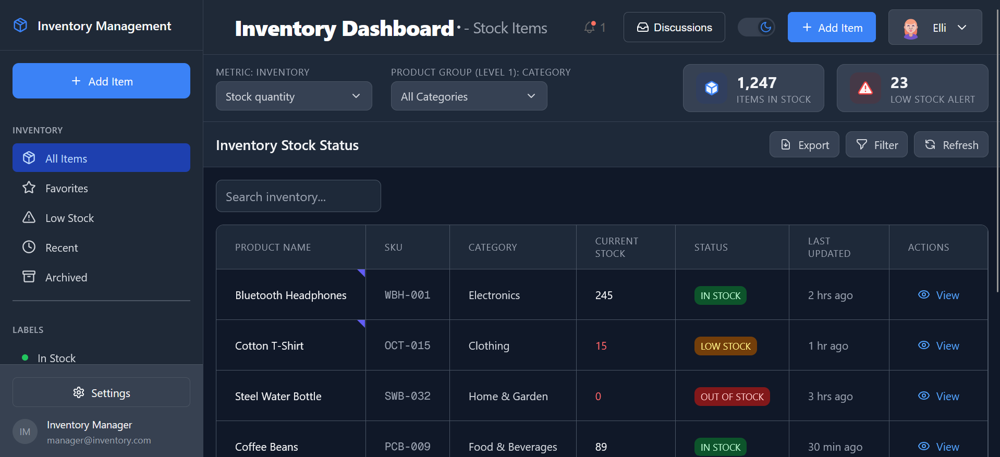

# 📦 Modern Inventory Management Dashboard

> **Built with Kiro AI IDE** - Build a lightweight internal dashboard for warehouse and logistics teams to track shipment statuses and collaborate on fulfillment issues. Use Tanstack for a data grid showing shipments, status, and ETA, with a detail view for each order. Integrate Velt to enable contextual commenting with tag mentions, reactions, and sidebar filtering for focused discussions on delays or product problems. 

### 📸 Kiro IDE in Action


*Kiro AI IDE interface showing the collaborative development process with real-time code generation and refinement*

---


## 🎯 Tutorial Overview

This project serves as a complete guide for building a modern inventory management dashboard using cutting-edge technologies and AI-assisted development. Perfect for developers looking to understand how to combine multiple libraries into a cohesive, production-ready application.

## 🎯 Project Overview

This project demonstrates how warehouse and logistics teams can collaborate effectively on inventory management through real-time comments, @mentions, and intelligent filtering. Built as a showcase for combining modern web technologies with AI-powered development workflows using **Kiro IDE**.

### ✨ Key Features

- 📊 **Interactive Data Grid** - TanStack Table with sorting, filtering, and search
- 💬 **Real-time Collaboration** - Velt-powered comments with @mentions and notifications



- 📱 **Detail Views** - Comprehensive item information modals


- 👥 **Team Mentions** - @steve, @elli for role-based collaboration
- 🎨 **Modern UI** - Responsive design with dark mode support

---

## 🛠️ Tech Stack & Library Combinations

This project demonstrates the powerful combination of modern web technologies, each chosen for specific capabilities:

### **🚀 Core Framework Stack**
```json
{
  "next": "15.2.2",
  "react": "19.0.0",
  "typescript": "^5"
}
```
- **Next.js 15.2.2** - Latest React framework with App Router for optimal performance
- **React 19** - Cutting-edge React features and concurrent rendering
- **TypeScript** - Full type safety across the entire application

### **📊 Data Management Powerhouse**
```json
{
  "@tanstack/react-table": "^8.20.5",
  "@tanstack/react-virtual": "^3.10.8"
}
```
- **TanStack Table v8** - Advanced table functionality with sorting, filtering, and pagination
- **TanStack Virtual** - Performance optimization for large datasets
- **Custom State Management** - Efficient filtering and search implementations

### **🎨 UI & Styling Excellence**
```json
{
  "tailwindcss": "^3.4.1",
  "lucide-react": "^0.468.0",
  "@radix-ui/react-*": "^1.0.0"
}
```
- **Tailwind CSS** - Utility-first styling with custom design system
- **Lucide React** - Consistent, modern icon library
- **Radix UI** - Accessible, unstyled UI primitives

### **💬 Real-time Collaboration**
```json
{
  "@veltdev/react": "^1.0.0",
  "@veltdev/types": "^1.0.0"
}
```
- **Velt SDK** - Professional-grade collaboration features
- **Custom @mention System** - Team-based notifications and workflows
- **Real-time Comments** - Contextual discussions on inventory items

### **⚡ Development & Build Tools**
```json
{
  "eslint": "^8",
  "postcss": "^8",
  "@types/node": "^20"
}
```
- **Kiro AI IDE** - AI-powered development environment
- **ESLint** - Code quality and consistency enforcement
- **PostCSS** - Advanced CSS processing and optimization

### **🔗 Why These Libraries Work Together**

1. **Next.js + TanStack Table** = Server-side rendering with client-side interactivity
2. **TypeScript + Velt SDK** = Type-safe collaboration features
3. **Tailwind + Radix UI** = Rapid styling with accessibility built-in
4. **React 19 + TanStack Virtual** = Optimal performance for large datasets

---

## 🤖 Built with Kiro AI IDE

This entire project was developed using **Kiro AI IDE**, showcasing how AI-assisted development can accelerate complex application building while maintaining code quality and best practices.

### 🎯 Key Kiro Prompts Used

#### Initial Project Setup
```
Create a collaborative inventory management dashboard with the following requirements:

SUMMARY: A simple dashboard showing inventory data and allowing internal discussion on stock issues and fulfillment problems.

KEY FEATURES:
- Data grid with inventory items, status, stock levels
- Detail view for each record  
- Comments on specific items with @tag mentions
- Reactions and sidebar filter for discussions
- Focus on inventory management rather than shipment tracking

TECH STACK:
- TanStack Table for data grid
- Next.js with TypeScript
- Velt comments and notifications for collaboration
- Modern UI with responsive design

USE CASE: Shows how warehouse and logistics teams can comment on low stock items, supplier issues, and inventory problems collaboratively. Team members should be able to @mention each other (like @steve @elli) to coordinate restocking and resolve inventory issues.

Make it professional and production-ready with proper error handling and TypeScript compliance.
```

#### UI Enhancement Prompt
```
Remove Discussions and reactions section from side bar 
make UI attractive
remove these blue colors looks overwhelming make rest components shorter and professional here
make stock threshold components little color full cant see entire close and edit buttons
```

### 🔄 AI-Assisted Development Journey

The development process with Kiro demonstrated:

1. **🎯 Requirement Understanding** - Kiro translated business needs into technical specifications
2. **🔧 Multi-Library Integration** - Seamlessly combined TanStack Table, Velt SDK, Next.js, and Tailwind
3. **🎨 UI/UX Refinement** - Iterative design improvements based on visual feedback
4. **🐛 Problem Solving** - Resolved complex issues like modal visibility and component conflicts
5. **📱 Responsive Design** - Automatic mobile-first approach with professional styling
6. **⚡ Performance Optimization** - Implemented virtualization and efficient state management


## 🚀 Getting Started

### Prerequisites

- Node.js 18+ 
- npm or yarn
- Velt API key (for collaboration features)

### Installation

```bash
# Clone the repository
git clone https://github.com/your-username/inventory-management-dashboard.git
cd inventory-management-dashboard

# Install dependencies
npm install

# Set up environment variables
cp .env.example .env.local
# Add your Velt API key to .env.local

# Start development server
npm run dev
```

### Environment Setup

```env
NEXT_PUBLIC_VELT_API_KEY=your_velt_api_key_here
```

---

## 📋 Project Structure

```
├── app/                    # Next.js App Router
│   ├── page.tsx           # Main dashboard page
│   ├── layout.tsx         # Root layout
│   └── globals.css        # Global styles
├── components/            # React components
│   ├── InventoryTable.tsx # Main data grid
│   ├── DetailView.tsx     # Item detail modal
│   ├── Sidebar.tsx        # Navigation and filters
│   ├── VeltProvider.tsx   # Collaboration setup
│   └── MentionsGuide.tsx  # @mention help
├── helper/               # Utilities
│   └── userdb.ts         # User management
├── types/                # TypeScript definitions
│   └── delivery.ts       # Data models
└── utils/                # Helper functions
```

---

## 👥 Team Collaboration Features

### @Mention System

The dashboard includes a comprehensive @mention system for team coordination:

```typescript
// Available team members
const teamMembers = [
  { name: "Steve", role: "Warehouse Manager" },
  { name: "Elli", role: "Inventory Specialist" }
];
```

### Usage Examples

- `@steve can you check this low stock item?`
- `@alex please coordinate with supplier for restock`
- `@jordan analyze this inventory trend`
- `@elli update the stock levels for this item`

---

## 🎨 UI/UX Highlights

### Responsive Design
- **Desktop-first** approach with mobile optimization
- **Sidebar navigation** with collapsible categories
- **Modal overlays** for detailed item views
- **Dark mode support** throughout the interface

### Interactive Elements
- **Hover effects** on table rows and buttons
- **Loading states** for async operations
- **Visual feedback** for filter selections
- **Smooth transitions** between states

---


## 📊 Sample Data Structure

```typescript
interface InventoryItem {
  id: string;
  ProductName: string;
  SKU: string;
  Category: string;
  CurrentStock: number;
  MinStock: number;
  MaxStock: number;
  Status: 'IN STOCK' | 'LOW STOCK' | 'OUT OF STOCK';
  LastUpdated: string;
  Supplier?: string;
  Location?: string;
  UnitPrice?: number;
}
```

---

## 🎯 Use Cases & Scenarios

### 1. Low Stock Management
- **Alert System**: Visual indicators for items below minimum threshold
- **Team Coordination**: @mention warehouse managers for restocking
- **Supplier Communication**: Track reorder status and delivery dates

### 2. Inventory Discussions
- **Cell-level Comments**: Comment on specific data points
- **Issue Tracking**: Mark problems as resolved/unresolved
- **Knowledge Sharing**: Document solutions for future reference

### 3. Cross-team Collaboration
- **Role-based Mentions**: Target specific team members by expertise
- **Filter by Discussions**: Find items with active conversations
- **Priority Management**: Use reactions to mark urgent items

---

## 🚀 Deployment

### Vercel (Recommended)

```bash
# Install Vercel CLI
npm i -g vercel

# Deploy
vercel --prod
```


## 🤝 Contributing

1. Fork the repository
2. Create a feature branch (`git checkout -b feature/amazing-feature`)
3. Commit your changes (`git commit -m 'Add amazing feature'`)
4. Push to the branch (`git push origin feature/amazing-feature`)
5. Open a Pull Request

---

## 📝 License

This project is licensed under the MIT License - see the [LICENSE](LICENSE) file for details.

## 📚 Tutorial Sections

This README serves as a comprehensive tutorial covering:

### 🏗️ **Part 1: Project Architecture**
- Setting up Next.js 15 with TypeScript
- Configuring TanStack Table for complex data operations
- Integrating Velt SDK for real-time collaboration

### 🎨 **Part 2: UI Development**
- Building responsive layouts with Tailwind CSS
- Creating professional modals and overlays
- Implementing dark mode and accessibility features

### 💬 **Part 3: Collaboration Features**
- Setting up @mention systems
- Real-time commenting on data rows
- Team-based notification workflows

### ⚡ **Part 4: Performance Optimization**
- Implementing virtualization for large datasets
- Optimizing re-renders with React 19 features
- Bundle optimization and deployment strategies

---

## 🎯 Learning Outcomes

After following this tutorial, you'll understand:

- ✅ How to combine multiple complex libraries effectively
- ✅ AI-assisted development workflows with Kiro IDE
- ✅ Building production-ready collaborative applications
- ✅ Modern React patterns and performance optimization
- ✅ Professional UI/UX design principles
- ✅ TypeScript best practices in large applications

---

## 🚀 Quick Start for Tutorial

```bash
# Clone and setup
git clone <repository-url>
cd inventory-management-dashboard
npm install

# Environment setup
echo "NEXT_PUBLIC_VELT_API_KEY=your_key_here" > .env.local

# Start development
npm run dev
```

---

## 🙏 Acknowledgments & Credits

- **🤖 Kiro AI IDE** - Primary development environment that made this project possible
- **💬 Velt** - Collaboration infrastructure and real-time features
- **📊 TanStack** - Powerful data management and virtualization
- **⚡ Vercel** - Deployment platform and Next.js ecosystem
- **🎨 Tailwind Labs** - CSS framework and design system

---

## 📞 Tutorial Support

- **📖 Full Tutorial**: Available as blog post series
- **💻 Live Demo**: [View the completed application](https://your-demo-url.vercel.app)
- **🎥 Video Walkthrough**: Coming soon on YouTube
- **💬 Community**: Join our Discord for questions and discussions

---

<div align="center">

### **🎓 Built as Educational Content**

**This project demonstrates the power of AI-assisted development with Kiro IDE**

*Perfect for developers learning modern React patterns, collaboration features, and professional UI development*


---

**⭐ Star this repository if you found the tutorial helpful!**

</div>